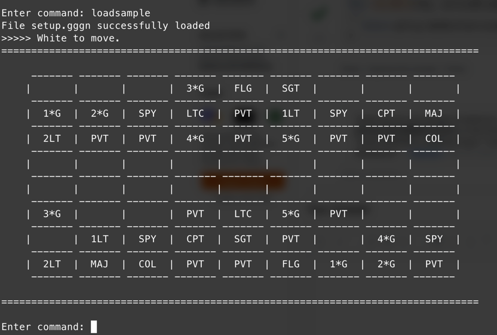

# gg



Simplistic implementation of the [Game of the Generals](https://en.wikipedia.org/wiki/Game_of_the_Generals) board game, playable on a console terminal.

## Inspiration

This is a weekend project that I challenge myself to complete with the goal of just having any working prototype of the _Game of the Generals_ board game. I found it overwhelming how many different ways to start a Go project there is, so I decided to start with a single [main.go](./main.go) file. Which surprisingly held through the end and I never had the urge to split it into multiple files. A handful of todos are left scattered, but I'm satisfied with the result so far. It's a refreshing experience indeed.

## Features

- Loading of game state via text files.
- Complete movement validation.
- Win by either flag capturing or by ferrying your flag across the board.

**Limitations**

- No fog of war -- this is a prototype and I felt like networking is out of scope for what I'm aiming for.
- No tests -- although I placed some interfaces so that pieces of the game can be mocked, I didn't feel the need to add the tests themselves.

## Usage

```console
$ go run .
```

You can view the logs by running it with the `-logs=true` flag.

## License

See [LICENSE](./LICENSE)
